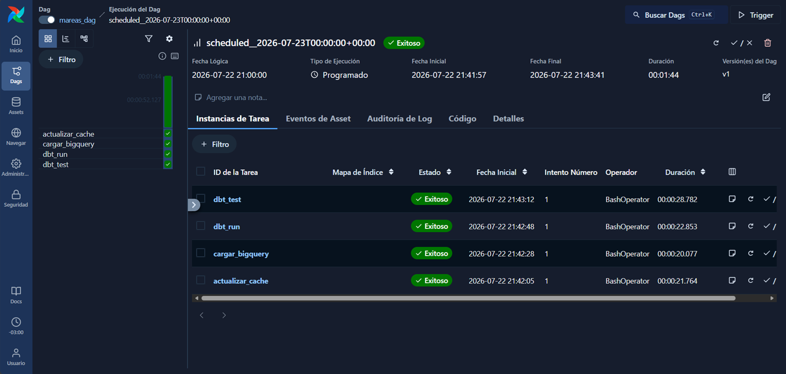
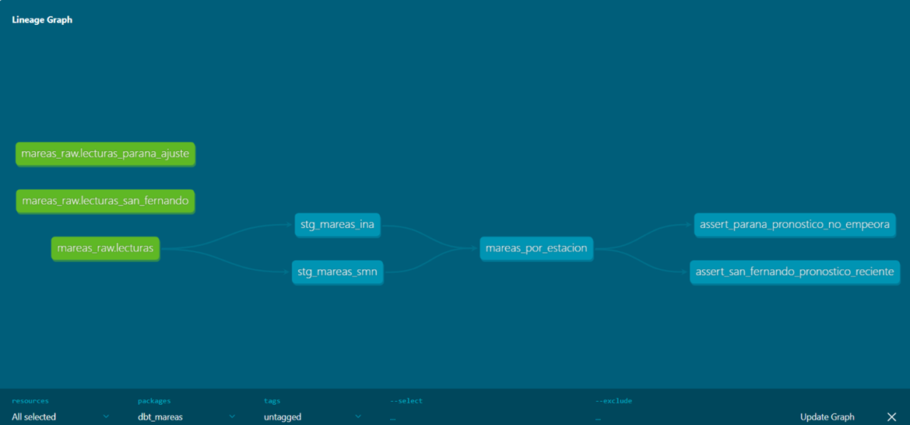
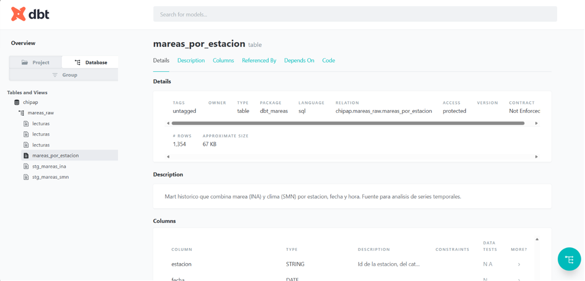

# Mareas - Tide & Weather Dashboard

A Django app that displays tide heights and weather data for Argentine river stations.  
Data comes from two official sources: INA (Instituto Nacional del Agua) and SMN (Servicio Meteorológico Nacional).

**No database. No configuration. Clone and run.**

---

## What it does

- Current tide height, trend (rising / falling / stable), and next high/low tide
- Weather data: temperature, wind speed & direction, rainfall
- SVG chart built in vanilla JS (no visualization library)
- 3 stations: San Fernando, Rosario, Zárate
- Up to 4 days of forecast
- Visual theme changes based on time of day (dawn / day / sunset / night)

---

## Architecture

No ORM, no migrations, no database.

```
mareas/
├── services/
│   ├── stations.py         # station catalog from JSON
│   ├── source.py           # per-station JSON cache
│   ├── refresh.py          # fetches INA REST API + SMN ZIP/TXT
│   ├── transform.py        # interpolates height, detects extremes, merges weather
│   ├── landing.py          # builds view context with controlled fallback
│   ├── bigquery_export.py  # flattens the cache into rows for the raw BigQuery table
│   └── data/
│       ├── estaciones.json
│       └── cache/          # one JSON file per station
├── views/
│   ├── index.py
│   └── actualizar.py       # token-protected endpoint for scheduled refresh
└── management/commands/
    ├── mareas_actualizar_datos.py
    └── mareas_cargar_bigquery.py   # incremental load into mareas_raw.lecturas

dbt_mareas/         # dbt project: staging + mart models on top of mareas_raw
airflow_dags/        # DAG definition only - the Airflow engine itself lives in a sibling repo
```

Data pipeline: INA REST JSON + SMN ZIP/TXT → grouped & merged → local JSON cache → transform layer → Django template

---

## Data pipeline

The app itself never talks to BigQuery. `mareas_cargar_bigquery`,
`dbt_mareas`, and `airflow_dags` are a **parallel, optional layer** for
historical analysis. They don't change what the visitor sees or how
fast the page loads.

**Why the app keeps serving from JSON.** The Django views read the local
per-station cache the same way they always did. No network round-trip to
BigQuery on a page visit, no added latency, no new failure mode for the
end user. Simplicity for the visitor is the priority; the data warehouse
lives entirely outside that request path.

**Why the history lives separately, with incremental load.** The local
cache is small and gets overwritten on every refresh: it only ever holds
the current forecast window (today + up to 4 days), and that window
shifts forward daily. If the loader just appended every run's readings
blindly, the same `estacion + fecha + hora` would get re-inserted every
day it happened to fall inside that window — `mareas_raw.lecturas` would
grow without bound and never really represent "one row per real
reading". Instead, `mareas_cargar_bigquery` does a `MERGE`: insert rows
for keys it hasn't seen, update matched keys with the most recent
`marca_temporal_carga` (a forecast for a given date gets more accurate
as the date approaches, so the latest load wins). The table still
accumulates a real time series across runs — it just doesn't duplicate
the days that overlap between one run and the next. That's what makes
it possible to later ask questions like "how did the tide at Rosario
trend over the last three months" (something the JSON cache structurally
can't answer) without the row count being inflated by re-loads of the
same forecast window.

**Diagram:**
```
INA API + SMN ZIP/TXT
       |
  refresh.py / transform.py
       |
       ├──> local JSON cache ──> Django app (end user)
       |
       └──> mareas_cargar_bigquery ──> BigQuery (mareas_raw.lecturas)
                   |
                dbt run/test (staging + mart)
                   |
            Airflow (daily orchestration: refresh → load → dbt run → dbt test)
```



**The first real load, in numbers.** The initial `mareas_cargar_bigquery`
run uploaded 195 rows to `mareas_raw.lecturas`: 101 from San Fernando, 47
from Rosario, and 47 from Zárate — before the decision to only track San
Fernando going forward (see below). All of them carried `fuente_origen =
'ina'`, because at that specific point in time none of the three local
caches carried SMN weather data yet: temperature/wind/rain fields were
empty, and `flatten_station_records` skips a source entirely if no row
has data for it (see `mareas/services/bigquery_export.py`). That's since
been resolved: the current cache does carry SMN, so each record now
splits into one `ina` row and one `smn` row. That's exactly why the mart
holds more rows than fit in a single run — it keeps accumulating one
`ina` + one `smn` row per genuinely new `fecha + hora` across runs, on
top of that first load.

**Cost ceiling.** Both `mareas_cargar_bigquery` and the dbt profile
(`dbt_mareas/profiles.yml.example`) set `maximum_bytes_billed` on every
query (200 MB). At this project's actual data volume that limit should
never be reached — it exists so a bug or an unexpected change in scale
fails loudly instead of quietly running up a bill.

**Design difference vs. Lanchas (sibling project).** Lanchas' BigQuery
layer does a full-refresh, idempotent load: each run replaces the
dataset outright, because Lanchas only cares about the current schedule.
Mareas does the opposite on purpose: incremental `MERGE` (upsert), because the
whole point here is retaining history for time-series analysis of tide
and weather. Same infra pattern (BigQuery + dbt + Airflow), different write
strategy: chosen deliberately for each use case, not a default either
project fell into.

**Why BigQuery only tracks San Fernando.** INA publishes tide forecasts
through per-station model runs (`calId` in their API). San Fernando's
model (`calId=432`, "regre_sfer") runs daily and is current. Rosario's
and Zárate's model (`calId=489`, "288_ajuste_salidas") stopped producing
new runs on 2026-06-26, confirmed directly against INA's API (no other
`calId` serves those two stations' series either) — an outage on INA's
side, not a bug in this pipeline. With that model frozen, loading
Rosario/Zárate into BigQuery would just mean paying (in query bytes
scanned on every daily `dbt run`/`dbt test`) to keep re-processing the
same stale forecast, with no real historical signal to show for it. So
`mareas_cargar_bigquery` only loads San Fernando (see
`airflow_dags/mareas_dag.py`); Rosario and Zárate keep being served live
on the dashboard straight from their local JSON cache, same as always —
this only affects the BigQuery/dbt history layer, not what the visitor
sees.

`mareas_actualizar_datos` still treats a degraded station as **partial
degradation, not a hard failure** when refreshing the local cache that
serves the live app: it updates whichever stations INA actually has data
for and logs the rest as `WARNING`s (station key + INA's error), instead
of aborting the whole run. It only exits non-zero if *every* station
fails (a real outage). This is independent of the BigQuery decision
above — it's what keeps the dashboard itself resilient to one station's
upstream source being stuck.

On the BigQuery side, since only San Fernando is loaded, `dbt source
freshness` (`dbt_mareas/models/staging/sources.yml`) checks a single
threshold, no per-station split needed. Note a subtlety documented in
that file: the `loaded_at_field` (`marca_temporal_carga`) is a *load*
timestamp, so if San Fernando's own model ever got stuck the same way
Rosario/Zárate's did, freshness alone wouldn't catch it (the row would
still get re-merged daily with a fresh timestamp). The actual
"is the forecast content stuck" signal is
`dbt_mareas/tests/assert_san_fernando_pronostico_reciente.sql`, which
checks `MAX(fecha)` against today's date as a real `error` (San
Fernando's model should never lag more than 2 days).

---

## dbt modeling

Three models, two layers — San Fernando only (see "Why BigQuery only
tracks San Fernando" above):

- **Staging** (`stg_mareas_ina`, `stg_mareas_smn`, materialized as
  `view`): each one filters `mareas_raw.lecturas` by `fuente_origen`
  ('ina' or 'smn'). No business transformation happens here, just the
  source split plus one safety measure: a `qualify row_number() over
  (partition by estacion, fecha, hora order by marca_temporal_carga
  desc) = 1`, so that even if a duplicate ever reached the raw table
  (e.g. rows loaded before `mareas_cargar_bigquery` did `MERGE`), only
  the most recent version of each key survives into staging.
- **Mart** (`mareas_por_estacion`, `table`): does a `full outer join` of
  the two stagings on `estacion + fecha + hora`, so each row carries
  tide height (INA) and weather (SMN) for the same moment when both
  sources have data for that timestamp, or just one of the two when they
  don't. It's the table that answers "how was the tide and weather in
  San Fernando on a given day."





**Tests.** Generic tests on the mart: `not_null` on `estacion` and
`fecha`, `accepted_values` on `estacion` (`san_fernando`, the only value
it should ever take now). On top of that, two singular tests check
content, not just schema:

- `assert_san_fernando_pronostico_reciente` (severity `error`): fails if
  `MAX(fecha)` is more than 2 days behind today. San Fernando's INA
  model runs daily, so a lag here is a real pipeline problem and should
  block the DAG.
- `assert_staging_sin_duplicados` (severity `error`): fails if either
  staging model ever has more than one row for the same
  `estacion + fecha + hora` — the signal that the `qualify` dedup above
  (or the `MERGE` in `mareas_cargar_bigquery`) stopped working and the
  mart join could be fanning out.

`dbt source freshness` run against real BigQuery data measures whether
the loader ran, not whether the source forecast advanced — a caveat
documented in `dbt_mareas/models/staging/sources.yml`. That's exactly
why `assert_san_fernando_pronostico_reciente` exists: it's the real
staleness signal that `source freshness` structurally can't provide.

---

## Orchestration with Airflow

The Airflow engine doesn't live in this repo. It lives in a sibling
repo, `airflow_repo`, with its own Docker image (a `Dockerfile` that
installs `requirements_mareas.txt` + `requirements_data.txt` on top of
`apache/airflow:3.3.0`). That's deliberate: the engine is meant to be
reusable across projects (Lanchas next, after Mareas), not coupled to
just this one.

How the two repos connect:

- `airflow_repo` mounts this repo as a volume at `/opt/mareas` inside
  the container (code and credentials only), with no dependency on any
  venv created on the host. The image already has Django, `dbt-bigquery`,
  and `google-cloud-bigquery` installed.
- The DAG (`airflow_dags/mareas_dag.py`) is versioned **here**, in
  `mareas_repo`, not in `airflow_repo`. It's synced to
  `airflow_repo/dags/` with a script (`airflow_repo/scripts/sync_dags.sh`)
  that copies the file instead of symlinking it, since real symlinks
  aren't available on Windows/Git Bash without elevated privileges.
- The DAG orchestrates `actualizar_cache → cargar_bigquery → dbt_run →
  dbt_test`, runs `@daily` with `catchup=False`, and uses the same
  environment variables (`GCP_PROJECT_ID`, `GCP_DATASET_RAW`,
  `GCP_LOCATION`, `GOOGLE_APPLICATION_CREDENTIALS`) as the section below.

The screenshot above is from a real run of this DAG.

---

## Stack

Python 3.11 · Django 4.2 · Whitenoise · Vanilla JS · CSS custom properties · `urllib`

Data layer (optional, parallel): BigQuery · dbt · Airflow · Docker (custom Airflow image)

---

## Running it locally

Everything above covers how the app and the data pipeline are designed.
The steps below are for anyone who wants to run it locally, starting
with the app itself and going as deep into the data layer as they like.

### 1. Run the app

Requirements: Python 3.11+

**Linux / Mac:**
```bash
git clone https://github.com/chipap-dev/mareas.git
cd mareas
python -m venv venv
source venv/bin/activate
pip install -r requirements_mareas.txt
python manage.py runserver
```

**Windows (Git Bash):**
```bash
git clone https://github.com/chipap-dev/mareas.git
cd mareas
python -m venv venv
source venv/Scripts/activate
pip install -r requirements_mareas.txt
python manage.py runserver
```

**Windows (CMD / PowerShell):**
```bat
git clone https://github.com/chipap-dev/mareas.git
cd mareas
python -m venv venv
venv\Scripts\activate
pip install -r requirements_mareas.txt
python manage.py runserver
```

Open [http://localhost:8000](http://localhost:8000)

The app loads with cached data already included in the repo. No API calls needed.

### 2. Refresh the data (optional)

```bash
cd mareas
python manage.py mareas_actualizar_datos
```

Other commands:

```bash
python manage.py mareas_listar_estaciones   # list stations and cache status
python manage.py mareas_validar_fuente      # validate cache integrity
python manage.py mareas_ver_contexto        # inspect the full rendered context
```

### 3. Run the data layer (BigQuery + dbt)

Environment variables (already defined in `.env.example` / `.env`):

```
GCP_PROJECT_ID=chipap
GCP_DATASET_RAW=mareas_raw
GCP_LOCATION=us-central1
GOOGLE_APPLICATION_CREDENTIALS=secrets/gcp-key.json
```

`secrets/gcp-key.json` is a service account key with `BigQuery Data
Editor` + `BigQuery Job User` on the `chipap` project. It's git-ignored,
so it never ships with the repo: spin up your own GCP project (BigQuery's
free tier is enough) and point `GOOGLE_APPLICATION_CREDENTIALS` at your
own key.

Install the extra dependencies (kept out of `requirements_mareas.txt` so
the Django deploy stays light):

```bash
pip install -r requirements_data.txt
```

Load the current cache into BigQuery. In production only San Fernando is
loaded (see "Why BigQuery only tracks San Fernando" above); `--station`
also works for any other station if you want to experiment locally:

```bash
python manage.py mareas_cargar_bigquery --station san_fernando
```

Run dbt (from `dbt_mareas/`):

```bash
cd dbt_mareas
cp profiles.yml.example profiles.yml   # edit the keyfile path if needed, never commit this file
dbt run
dbt test
dbt docs generate
```

`dbt parse` works without real credentials (useful for a quick syntax
check in CI).

The Airflow DAG (`airflow_dags/mareas_dag.py`) isn't run from this repo.
See [Orchestration with Airflow](#orchestration-with-airflow) above for
where it actually runs and how the two repos connect.

---

Built by [Claudia Cáceres](https://chipap.net) · [LinkedIn](https://linkedin.com/in/claudiacaceresv) · Buenos Aires, Argentina
